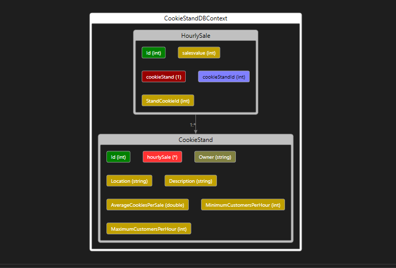

# Pat's Salmon Cookie Stand API

This is the backend API for Pat's Salmon Cookie Stand application. It provides endpoints to manage cookie stands, including creating, reading, updating, and deleting cookie stand data. The API is built using ASP.NET Core and interacts with a database to store and retrieve cookie stand information.

### Deployed API Swagger Documentation [Click Here](https://salmoncookiesapi20231004145021.azurewebsites.net/Swagger/index.html)

### ERD




### API Endpoints

#### Create a Cookie Stand

- **POST** `/api/cookiestand`

  Creates a new cookie stand with the provided data.

  Request Body (JSON):
  ```json
  {
    
  "location": "Jerash",
  "description": "description3",
  "minimumCustomersPerHour": 2,
  "maximumCustomersPerHour": 8,
  "averageCookiesPerSale": 2.5,
  "owner": "owner3"

  }
  ```

#### Get All Cookie Stands

- **GET** `/api/cookiestands`

  Retrieves a list of all cookie stands with their data.

    ```json
    [
    {
    "id": 3,
    "location": "Jerash",
    "description": "description3",
    "hourlySale": [
      19,
      13,
      10,
      11,
      8,
      17,
      12,
      17,
      15,
      10,
      15,
      11,
      17,
      6
    ],
    "minimumCustomersPerHour": 2,
    "maximumCustomersPerHour": 8,
    "averageCookiesPerSale": 2.5,
    "owner": "owner3"
  },
  {
    "id": 4,
    "location": "Irbid",
    "description": "description4",
    "hourlySale": [
      11,
      12,
      9,
      13,
      13,
      8,
      12,
      8,
      8,
      11,
      8,
      15,
      16,
      8
    ],
    "minimumCustomersPerHour": 3,
    "maximumCustomersPerHour": 7,
    "averageCookiesPerSale": 2.5,
    "owner": "owner4"
  },
  {
    "id": 5,
    "location": "Amman",
    "description": "description5",
    "hourlySale": [
      24,
      19,
      19,
      23,
      24,
      17,
      17,
      19,
      22,
      24,
      23,
      22,
      22,
      20
    ],
    "minimumCustomersPerHour": 7,
    "maximumCustomersPerHour": 10,
    "averageCookiesPerSale": 2.5,
    "owner": "owner5"
  }
  ]

  ```


#### Get Cookie Stand by ID

- **GET** `/api/cookiestand/{id}`

  Retrieves a single cookie stand by its unique ID.

```json
{
  "id": 3,
  "location": "Jerash",
  "description": "description3",
  "hourlySale": [
    19,
    13,
    10,
    11,
    8,
    17,
    12,
    17,
    15,
    10,
    15,
    11,
    17,
    6
  ],
  "minimumCustomersPerHour": 2,
  "maximumCustomersPerHour": 8,
  "averageCookiesPerSale": 2.5,
  "owner": "owner3"
}
```
  

#### Update Cookie Stand

- **PUT** `/api/cookiestand/{id}`

  Updates an existing cookie stand with the provided data. Requires the ID to be included in the request body.

    Request Body (JSON):
  ```json
  {
    
  "location": "Aqaba",
  "description": "description3",
  "minimumCustomersPerHour": 2,
  "maximumCustomersPerHour": 8,
  "averageCookiesPerSale": 2.5,
  "owner": "owner3"

  }
  ```
  


#### Delete Cookie Stand

- **DELETE** `/api/cookiestand/{id}`

  Deletes a cookie stand by its unique ID.

